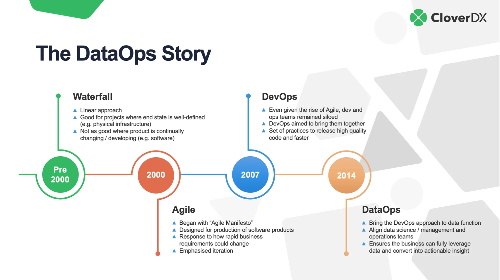

# DevOps

The word "DevOps" is a portmanteau of the words *Development* and *Operations*. It describes a set of philosophies and suggested best practices for producing and collaborating on software effectively, taking into account the pragmatic and sometimes harsh realities of delivering on projects in real-world contexts. DevOps guidelines attempt to recognize the messy nature of human experience in the context of  the even messier nature of complex IT systems in a rapidly changing society.

The words *development* and *operations* in the context of *DevOps* refer to a traditional (but very much still-common) way of organizing a business: One team, usually mostly consisting of IT, is responsible for the *development* of new information technology and surrounding processes. Another team or set of teams is responsible for core day-to-day operations of the business and are thus referred to as *Operations*. Such roles include traditional business domains such as Sales/Marketing, Accounting, HR, etc, as well as some IT roles such as database or network administrators. A business may be able to survive for a while without *development*, but *operations* is the daily lifeblood of the business.

The conflict comes when changes are proposed or made: development is tasked, usually by business executives, for the implementation of new features, for keeping the business ahead of competition, and adapting to trends in the industry. Operations is by necessity more rigid and conservative when it comes to adapting new technologies and techniques: new technologies tend to break, sometimes in a way that ends up being catastrophic to the business. Beyond that, humans are often creatures of habit and resistant to change when it comes to day-to-day work, especially if things are going even moderately well. If not properly managed, this latent tension at the heart of almost any business context can snowball out of control, as failures lead to decreased trust, decreased trust leads to decreased communication, and decreased communication leads to increases in the frequency and intensity of failures.

DevOps takes a look at these problems and puts forth some basic principles in an attempt help us work in healthily performing teams. To get an idea of these principles, we can go back even further in time and look at [*The Agile Manifesto*](https://agilemanifesto.org/), published in 2001 by some industry leaders including [Kent Beck](https://www.amazon.com/Test-Driven-Development-Kent-Beck/dp/0321146530), [Martin Fowler](https://martinfowler.com/books/refactoring.html), and ["Uncle Bob" Martin](https://www.digitalocean.com/community/conceptual-articles/s-o-l-i-d-the-first-five-principles-of-object-oriented-design). Here is the *Manifesto* its entirety:

!!! quote "The Agile Manifesto"
    We are uncovering better ways of developing software by doing it and helping others do it.
    Through this work we have come to value:

    - Individuals and interactions over processes and tools
    - Working software over comprehensive documentation
    - Customer collaboration over contract negotiation
    - Responding to change over following a plan

    That is, while there is value in the items on the right,
    we value the items on the left more.

While simplistic and squishy, these principles laid a powerful groundwork for the DevOps revolution to come. Almost every IT/software business in the industry has adopted at least some basic tenets of so-called Agile methodology. However, the long process of experimenting with these principles to figure out which techniques work - and which don't - has led to a lot of confusion and disagreement about what the principles mean and how they should be applied, sometimes to disasterous and painful effect. In many ways, the formalization of DevOps as a field and as a discipline is an ongoing response to this confusion and disagreement.

!!! question "What does this have to do with data?"

    Some of you may be surprised to be hearing about these topics in a Data Science course. While it may seem like this discussion veers outside the scope that Data Scientists and Data Engineers are usually put in, in my humble opinion these principles lie at the very core of the job Data Scientists and Data Engineers are tasked with -- making sense of data of various quality and complexity in real-word applications. Our jobs are to make sense of it in a way that has actual impact. The principles of DevOps are a great way to think about how to build and maintain systems that can handle the complexity and messiness of data.

!!! tip "Further Reading"

    The term *DevOps* is believed to be coined in 2009 by Patrick Debois, John Willis, and Gene Kim, who wrote a book on the topic named [*The Phoenix Project*](https://www.amazon.com/Phoenix-Project-DevOps-Helping-Business/dp/0988262592) in 2010. It presents a fictionalized story based on many real-world experiences around DevOps that are commonly encountered by businesses everywhere.
